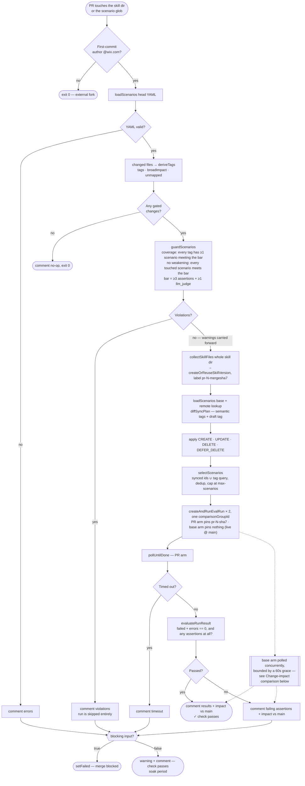
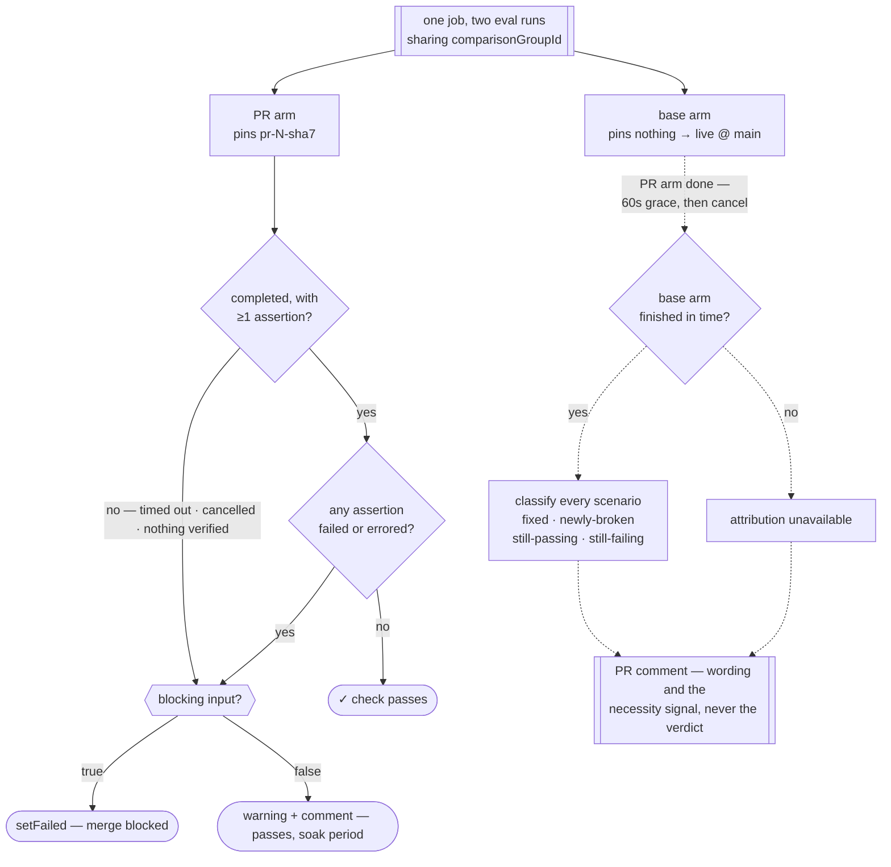
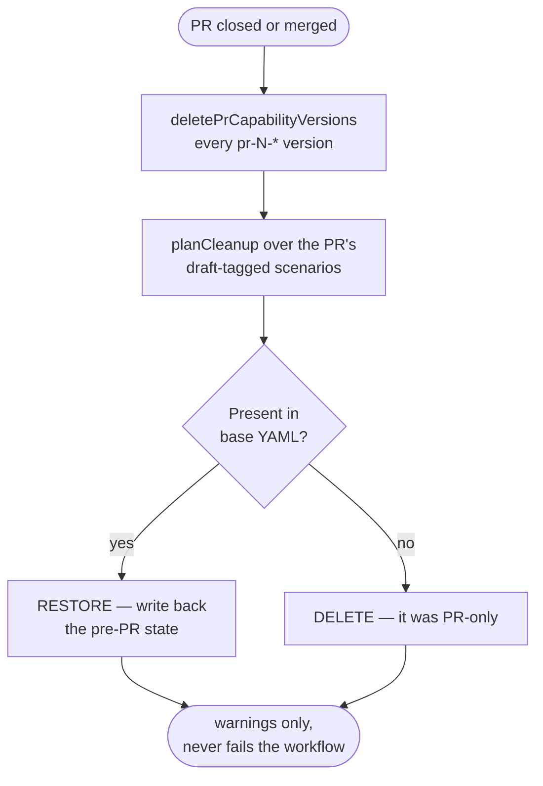

# `evalforge-skill-gate`

EvalForge flows for file-based skills — the skill's own files become the capability
content, so an eval run can evaluate *this PR's* version of a skill.

Four modes, in one action so they share one committed bundle:

| Mode | Trigger | What it does |
|---|---|---|
| `gate` | `pull_request` opened / synchronize / reopened / ready_for_review | Derives which eval tags the PR affects, enforces coverage, creates a PR skill version, runs the covering scenarios against it, comments the result |
| `analyze` | after `gate`, when it emits `analyze-run-id` | Requests EvalForge's AI investigation of that completed run and posts it as its own PR comment |
| `cleanup` | `pull_request` closed | Deletes the PR's capability versions and restores or removes its draft scenarios |
| `sync` | `pull_request` closed **and merged** | Reconciles the repo's scenario YAML into EvalForge, so EvalForge mirrors `main` |

All decision-making lives in [`packages/evalforge-core`](../../../packages/evalforge-core).
This action reads inputs, calls core, comments, and sets the check status.

## `gate` flow



The author gate and the coverage guard both come **before** any EvalForge write, so a fork
PR or a missing scenario costs no run.

**What gets uploaded, and how it's labelled.** The capability version carries the **whole
`skill-dir`**, minus `node_modules` and `dist`. The directory is the deployed unit: reference
docs point the agent at sibling paths like `<SKILL_ROOT>/scripts/generate-auto-patterns.js`
and tell it to run them, so uploading only the docs would break those capabilities at run
time — and the resulting eval failure would read as a skill regression rather than a gate bug.
Note this is a *different* question from `ignore-globs`, which only decides what **triggers** a
run. The version is labelled
`pr-<number>-<evaluated-sha7>`, where the evaluated SHA is `GITHUB_SHA`: on `pull_request`
that is the **merge** commit the workflow checked out, not the PR head. Labelling by head
would not uniquely identify the content, since the same head yields different merge results
as base advances — and `createOrReuseSkillVersion` would then reuse a version built from stale
content. The `pr-<number>-` prefix is what PR-close cleanup sweeps.

Two paths deliberately fail rather than reporting green, because each would otherwise be a
silent false pass:

- a scenario selection that resolves to **zero** ids — nothing would be verified;
- a completed run with **zero assertions** — no assertion failed, but none ran either.

## Change-impact comparison — what blocks

Comparison is **unconditional** — there is no opt-in input. Every gated PR runs the selected
scenarios **twice**, in one comparison group: the **PR arm**, with the PR's uploaded skill
content pinned as a capability version, and the **base arm**, which pins nothing at all —
that omission is what makes EvalForge live-fetch the git-linked capability at `main`. Same
preset agent, same scenario ids, same `runs-per-scenario`. The pinned version is the only
variable, which is what makes the difference attributable to the diff.

**Cost:** two eval runs per gated PR instead of one, each multiplied by `runs-per-scenario` —
unconditionally, not "two only when attribution lands". The base run always completes in
EvalForge and stays viewable in its comparison group even when the gate stops waiting for it,
because nothing here calls a cancel RPC against EvalForge; see the next paragraph for what
"cancelled" actually stops.

Only the **PR arm** decides the verdict. The base arm is bounded by a 60-second grace period
that starts once the PR arm finishes — but what gets cancelled at grace expiry is **only this
gate's own polling** of the base arm, not the base eval run itself. The run keeps executing and
completing in EvalForge regardless; the gate simply stops waiting on it and reports whatever it
has. So the base arm can never turn a green PR red, or a red PR green, and if polling does not
observe completion within the grace period, the comment reports **attribution unavailable** and
the gate is exactly as strict as it was before comparison existed.

The grace period (`base-arm-grace-seconds`, default `60`, max `300`) is the first knob worth
tuning once there is live evidence: if attribution is frequently unavailable in practice, the
doubled spend is buying nothing, and the fix is to widen the grace period rather than accept the
miss rate. It is a repo variable, not a code change — see [Inputs](#inputs).

`runs-per-scenario` (default `1`, max `20`) repeats each scenario that many times **per arm**,
at proportional cost. Above 1, an intermittent failure is visible as a mix of pass/fail
iterations on one side rather than being indistinguishable from a regression — and **an
intermittent failure counts as a failure**: `scenarioPassed` requires zero failures and zero
errors across the folded iterations.



Dotted edges inform the comment. Nothing on the dotted path reaches `blocking input?`, so a
base arm that times out, errors, or is cancelled at grace expiry degrades the report to
"attribution unavailable" and leaves the gate exactly as strict as it was.

| Base | PR | Class | Effect on the check |
|---|---|---|---|
| pass | pass | `still-passing` | silent |
| fail | pass | `fixed` | **passes** — reported as the necessity signal |
| pass | fail | `newly-broken` | **blocks** — this PR caused it |
| fail | fail | `still-failing` | **blocks** — labelled pre-existing |
| unusable | pass | — | **passes**, attribution unavailable |
| unusable | fail | — | **blocks**, attribution unavailable |

**Why `still-failing` blocks.** A scenario red on both sides tells you nothing about the
change — it is absence of signal, not evidence of safety, and this is the one rule
[`evalforge-yaml-gate`](../evalforge-yaml-gate) already enforces for wix-manage
(`comparisonHasNoWinner` fails when the `llm_judge` failed in *both* runs). Blocking on it
also keeps the gate's strictness identical to the pre-comparison behaviour: the block
condition remains "the PR run is fully green", so adding the comparison can only add
information, never permission to merge something that used to be rejected. The delta's
payoff is attribution and necessity, not a looser bar.

**Every scenario has a base result.** Both runs are given the same scenario ids, so a
scenario this PR *authored* still runs against whatever exists at `main`. That is exactly the
signal a new reference file wants: at `main` there is no such doc yet, so the base arm fails
it; the PR arm has the doc and passes; the scenario reports `fixed`. There is no "no
counterpart in base" case to special-case.

**A wholly `still-passing` PR is the strongest necessity signal available.** Every scenario
green on both sides means the measured behaviour did not move — either the change is a no-op
against the current suite, or the suite does not cover it. Neither blocks; both are worth
saying out loud in the comment.

**Nothing in the comparison knows it is comparing skills.** The PR arm's
`EvalRunInput.capabilityVersions` is a `Record<capabilityId, versionId>` with one entry per
**changed** entity, pinned at head. The base arm passes no `capabilityVersions` at all, so
every entity — changed or not — resolves through the git link to `main`. An entity the PR did
not touch is likewise absent from the PR arm's map, so both arms end up evaluating that entity
the same way — which is the "hold everything else constant" property the delta depends on.

Only two things are entity-typed: the per-entity path conventions used to derive tags, and the
mapping from content to a version body (`skillContent` for a skill, `mcpContent` for an MCP,
one case per future kind). Selection, the guard, the gate decision, classification and cleanup
are all entity-blind.

The **inputs** are still single-entity, though — `skill-dir` and `capability-id` are scalars,
and the entity list is built from them internally with one element. Generalising the input
surface so a rule needs no workflow change is follow-up work; what the comparison buys now is
that none of the *logic* will have to change. Whether a rule is even expressible as a
capability version is itself open — rules may live in agent config instead.

Once the input surface generalises, a PR that changes two entities would produce one PR arm
pinning both, so the delta attributes to *the PR*, not to either entity — separating them would
need one arm per subset. The comment would name which entities an arm pinned, so the ambiguity
stays visible rather than implied.

## `analyze` flow

```mermaid
flowchart TD
    GATE([gate emits analyze-run-id<br/>only on failed/errored assertions]) --> RUN[analyze mode: analyzeEvalRun]
    RUN --> OK{COMPLETED run,<br/>non-empty result?}
    OK -->|yes| POST([comment findings<br/>under its own marker])
    OK -->|"no — wrong status, timeout,<br/>5xx, or empty analysis"| UNAVAIL([comment "could not be<br/>generated" note])
    POST --> DONE([never calls setFailed])
    UNAVAIL --> DONE
```

`analyze` takes `eval-run-id` — the `gate` job's `analyze-run-id` output — and asks EvalForge
to investigate that run. EvalForge requires the run to be `COMPLETED`; any other status is a
400. A failed investigation never fails the check: it is advisory and runs in its own job,
so a red check beside a green gate would misrepresent the PR. Every failure path in the
investigation — a bad status, a timeout, a 5xx, or an empty analysis — still posts a short
"could not be generated" note rather than staying silent, since to someone waiting on it an
absent comment is indistinguishable from a bug. (The one exception is a missing input or
absent PR payload, which fails the job via `core.setFailed` — there is no comment channel to
report through.) The comment lives under its own sticky marker, separate from `gate`'s, so
the two never overwrite each other.

Nothing in this mode retracts a stale investigation, because a clean run never starts it. So
`gate` does: when a run comes back with no failed and no errored assertions it updates the
analysis comment — update-only, never creating one — with a note saying the earlier
investigation no longer applies.

## `cleanup` flow



Cleanup never fails the workflow. The PR is already closed, so a red check would not be
actionable; the next run sweeps whatever was left behind.

## How tags are derived

Changed paths are classified in a **fixed precedence, first match wins**:

| # | Changed path | Result |
|---|---|---|
| 1 | matches `ignore-globs` | ignored, silently |
| 2 | matches `broad-impact-globs` | **broad impact** → the whole suite is in play |
| 3 | `<reference-dir>/DASHBOARD_PAGE.md` | tag `dashboard-page` — lowercase, `_` → `-`, drop `.md` |
| 4 | `<reference-dir>/dashboard-page/API_SPEC.md` | tag `dashboard-page` — the directory name is already the tag |
| 5 | any other file under `skill-dir` | **unmapped** — warned about, triggers nothing |
| — | the scenario glob | no tag; changed scenarios are included in the run directly |
| — | anything else | ignored |

The ordering matters. A broad-impact file living inside `reference-dir` has to be
classified broad-impact *before* rule 3 sees it, or `references/CODE_QUALITY.md` would
derive a `code-quality` tag and the coverage guard would demand a scenario carrying a tag
no scenario will ever carry. A broad-impact path therefore derives **no tag** and is never
coverage-checked — its guarantee comes from running the whole suite instead.

`scripts/**` is ignored rather than treated as broad impact because ignoring it loses no
signal: a generator script emits reference files, so a script change that affects behaviour
arrives with the regenerated `.md` files in the same PR, and those trigger their own tags.

## The quality guard

The bar is **at least 3 assertions including one `llm_judge`**. Below it, a scenario would
run, pass, and have verified nothing — so the bar is folded into the coverage question
rather than checked separately.

| Situation | Result |
|---|---|
| A derived tag has no scenario at all | **blocks** |
| The tag's only scenarios are below the bar, PR touched neither | **blocks** |
| The tag has a good scenario and a weak one, PR touched neither | **passes**, warns on the weak one |
| The PR added or edited a scenario below the bar | **blocks**, even with a good sibling |

The third row is deliberately non-blocking: stopping a PR because of a two-assertion
scenario someone else wrote punishes the wrong author, and the predictable result is that
the threshold gets lowered or the gate gets bypassed.

The guard runs on repo YAML plus the changed-file list alone — no EvalForge calls, no
capability version, no run — so a coverage failure reports in seconds and costs nothing.

## Inputs

| Input | Modes | Default | Notes |
|---|---|---|---|
| `mode` | all | `sync` | `gate` · `analyze` · `cleanup` · `sync` |
| `github-token` | all | — | Author gate, changed files, PR comment |
| `evalforge-url` | all | — | Upgraded to HTTPS with a warning if it is not |
| `evalforge-project-id` | all | — | |
| `evalforge-app-id` / `evalforge-app-secret` | all | — | OAuth client credentials; both registered for log masking |
| `evals-glob` | `gate`, `cleanup`, `sync` | — | e.g. `yaml/wix-app-evals/**/*.{yml,yaml}` |
| `capability-id` | `gate`, `cleanup` | — | The capability the PR skill version is created under |
| `agent-id` | `gate` | — | Preset agent the run uses |
| `eval-run-id` | `analyze` | — | Eval run to investigate — the `gate` job's `analyze-run-id` output |
| `skill-dir` | `gate` | — | e.g. `skills/wix-app` |
| `reference-dir` | `gate` | `references` | Relative to `skill-dir` |
| `ignore-globs` | `gate` | `scripts/**` | Newline-separated, relative to `skill-dir` |
| `broad-impact-globs` | `gate` | `SKILL.md` + the six cross-cutting references | Newline-separated, relative to `skill-dir` |
| `max-scenarios` | `gate` | `25` | Touched scenarios kept first; anything cut is named in the comment |
| `runs-per-scenario` | `gate` | `1` | Max `20`. Each scenario repeats this many times **per arm**, so an intermittent failure is visible instead of indistinguishable from a regression — at proportional cost. An intermittent failure counts as a failure |
| `base-arm-grace-seconds` | `gate` | `60` | Max `300`. `0` means "don't wait for the base arm at all". Window the base arm gets after the PR arm completes before its poll is cancelled. Exceeding it degrades the comment to "attribution unavailable" without affecting the verdict — the base eval run itself still completes server-side either way |
| `blocking` | `gate` | `false` | `true` fails the check; anything else warns and passes |

`capability-id`, `agent-id`, `skill-dir` and `eval-run-id` are optional at the action level
because no single mode uses all of them. Each mode marks the ones it reads required, so a
misconfigured workflow fails at the first step rather than running with empty ids.

`gate` and `cleanup` modes need the base SHA checked out into `.action-src` alongside the
head checkout — the sync and cleanup plans compare against the base YAML to tell "PR-only"
from "pre-existing". See
[`evalforge-wix-app-gate.yml`](../../workflows/evalforge-wix-app-gate.yml).

## Using this from another repo

`wix/skills` is public, so reference the action directly rather than vendoring it. The
committed `ncc` bundle inlines `evalforge-core`, so the consuming repo takes **no
dependency on the package**.

```yaml
- uses: wix/skills/.github/actions/evalforge-skill-gate@<sha>
  with:
    mode: gate
    skill-dir: packages/my-skill
    reference-dir: docs
    broad-impact-globs: 'README.md'
    ignore-globs: 'tools/**'
    evals-glob: 'evals/**/*.{yml,yaml}'
    capability-id: 'your-evalforge-capability-id'   # plain ids, inline —
    agent-id: 'your-evalforge-agent-id'             # not secrets, reviewable in the diff
    github-token: ${{ secrets.GITHUB_TOKEN }}
    evalforge-url: ${{ vars.EVALFORGE_URL }}
    evalforge-project-id: 'your-evalforge-project-id'
    evalforge-app-id: ${{ secrets.YOUR_APP_ID }}
    evalforge-app-secret: ${{ secrets.YOUR_APP_SECRET }}
```

Your org policy has to permit actions from `wix/skills`. The real cost of adoption is not
code: it is the EvalForge-side setup (project, capability, preset agent, file template) and
authoring scenarios with tags.

## Working on this action

The bundle in `dist/` is what CI runs, and a required check fails if it is stale. After any
change here **or in `evalforge-core`**:

```bash
(cd packages/evalforge-core && yarn build)
(cd .github/actions/evalforge-skill-gate && yarn build)
```

Use the `(cd DIR && yarn SCRIPT)` subshell form, not `yarn --cwd DIR SCRIPT` — under
Corepack, `--cwd` resolves the yarn *version* from the real process cwd, so invoking it
from the repo root can silently run the wrong yarn.

Adding a dependency to `evalforge-core` also changes both consuming actions' lockfiles
through the `portal:` link. CI runs `yarn install --immutable`, so run a plain
`yarn install` in `evalforge-core` **and** in both actions, then commit all three
`yarn.lock` files.
