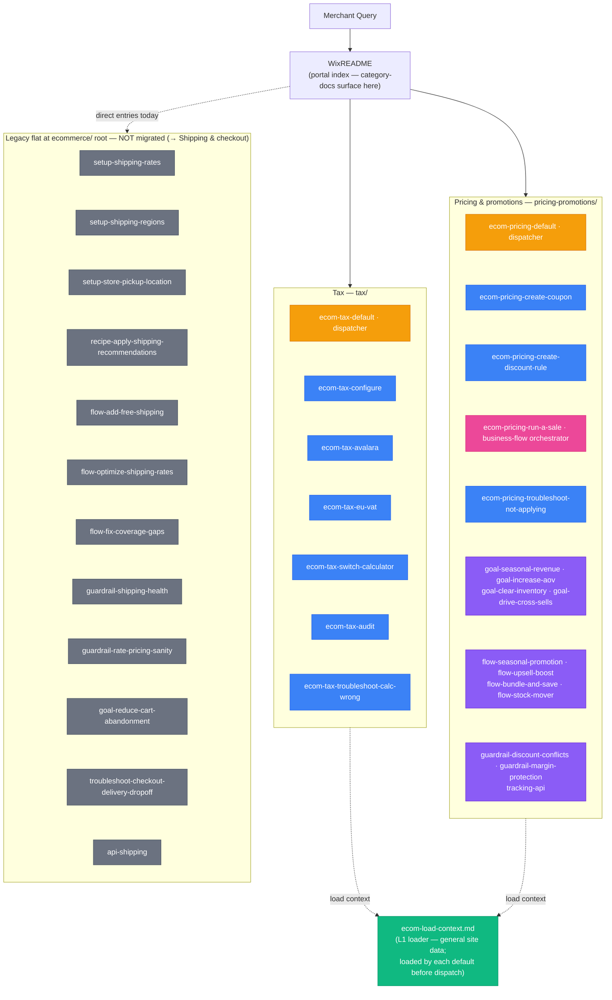

## Skill Graph Diagram

The arrows land on each L3 **group**; inside a group, files stack vertically with the `default` dispatcher first. Internal dispatch (default → promotion) and support chains (run-a-sale → goal → flow → guardrail/tracking) are documented in the reachability table below rather than drawn as edges.

## File Reachability

| File | Role | Reached via |
|---|---|---|
| `ecom-load-context.md` | L1 loader | Loaded by each `*-default` dispatcher before dispatch (skipped if context already loaded) |
| `ecom-tax.md` | category-doc | WixREADME portal index |
| `ecom-pricing.md` | category-doc | WixREADME portal index |
| `tax/ecom-tax-default.md` | dispatcher | `ecom-tax.md` |
| `tax/ecom-tax-configure.md` | promotion | tax dispatch `[intent:configure-tax]` |
| `tax/ecom-tax-avalara.md` | promotion | tax dispatch `[intent:avalara]` |
| `tax/ecom-tax-eu-vat.md` | promotion | tax dispatch `[intent:eu-vat]` |
| `tax/ecom-tax-switch-calculator.md` | promotion | tax dispatch `[intent:switch-calculator]` |
| `tax/ecom-tax-audit.md` | promotion | tax dispatch `[intent:audit-tax]` |
| `tax/ecom-tax-troubleshoot-calc-wrong.md` | promotion | tax dispatch `[intent:troubleshoot]` |
| `pricing-promotions/ecom-pricing-default.md` | dispatcher | `ecom-pricing.md` |
| `pricing-promotions/ecom-pricing-create-coupon.md` | promotion | pricing dispatch `[intent:create-coupon]` |
| `pricing-promotions/ecom-pricing-create-discount-rule.md` | promotion | pricing dispatch `[intent:create-discount-rule / add-ribbon / schedule-sale]` |
| `pricing-promotions/ecom-pricing-run-a-sale.md` | business-flow | pricing dispatch `[intent:run-a-sale / boost-business / seasonal-promo / clearance / increase-aov]` |
| `pricing-promotions/ecom-pricing-troubleshoot-not-applying.md` | promotion | pricing dispatch `[intent:troubleshoot]` |
| `pricing-promotions/ecom-pricing-goal-seasonal-revenue.md` | support | run-a-sale → SEASONAL |
| `pricing-promotions/ecom-pricing-goal-increase-aov.md` | support | run-a-sale → UPSELL_BOOST / SHIPPING |
| `pricing-promotions/ecom-pricing-goal-clear-inventory.md` | support | run-a-sale → STOCK_MOVER |
| `pricing-promotions/ecom-pricing-goal-drive-cross-sells.md` | support | run-a-sale → BUNDLE_AND_SAVE |
| `pricing-promotions/ecom-pricing-flow-seasonal-promotion.md` | support | goal-seasonal-revenue |
| `pricing-promotions/ecom-pricing-flow-upsell-boost.md` | support | goal-increase-aov |
| `pricing-promotions/ecom-pricing-flow-bundle-and-save.md` | support | goal-increase-aov / goal-drive-cross-sells |
| `pricing-promotions/ecom-pricing-flow-stock-mover.md` | support | goal-clear-inventory |
| `pricing-promotions/ecom-pricing-guardrail-discount-conflicts.md` | support | all pricing flows |
| `pricing-promotions/ecom-pricing-guardrail-margin-protection.md` | support | flow-upsell-boost / flow-stock-mover |
| `pricing-promotions/ecom-pricing-tracking-api.md` | support | run-a-sale (Steps 2 + 8) |
| Shipping & checkout legacy files | legacy flat | README direct entries today — pending migration into Shipping & fulfillment / Checkout & cart categories |
</content>
