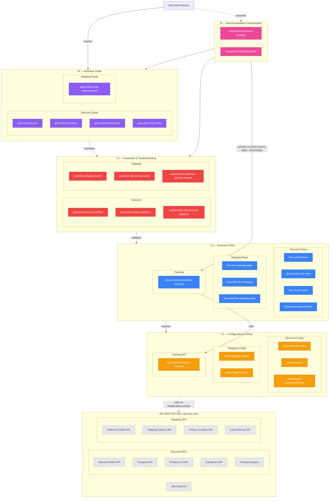

## Skill Graph Diagram

```mermaid
flowchart TB
    MR["Merchant Request"] --> |reactive| L6
    MR -.-> |proactive| R

    subgraph R["R — Recommendation Orchestration"]
        recommend-discount-strategy
        recommend-shipping-health
    end

    R --> L6
    R --> L5

    subgraph L6["L6 — Business Goals"]
        subgraph L6D["Discount Goals"]
            goal-increase-aov
            goal-clear-inventory
            goal-seasonal-revenue
            goal-drive-cross-sells
        end
        subgraph L6S["Shipping Goals"]
            goal-reduce-cart-abandonment
        end
    end

    L6 --> |evaluates| L5

    subgraph L5["L5 — Guardrails & Troubleshooting"]
        subgraph L5D["Discount"]
            guardrail-discount-conflicts
            guardrail-margin-protection
            troubleshoot-discount-not-applying
        end
        subgraph L5S["Shipping"]
            guardrail-shipping-health
            guardrail-rate-pricing-sanity
            troubleshoot-checkout-delivery-dropoff
        end
    end

    L5 --> |validates| L4

    subgraph L4["L4 — Business Flows"]
        subgraph L4D["Discount Flows"]
            flow-upsell-boost
            flow-bundle-and-save
            flow-stock-mover
            flow-seasonal-promotion
        end
        subgraph L4S["Shipping Flows"]
            flow-fix-coverage-gaps
            flow-add-free-shipping
            flow-optimize-shipping-rates
        end
        subgraph L4T["Tracking"]
            recipe-recommendation-tracking
        end
    end

    L4 --> |requires| L3
    R --> |"persists & tracks (unless SKIP_TRACKING)"| L4T
    L4T --> |calls| L3T

    subgraph L3["L3 — Configuration & Setup"]
        subgraph L3D["Discount Config"]
            setup-discount-rules
            setup-coupons
            api-discount-recommendations
        end
        subgraph L3S["Shipping Config"]
            setup-shipping-regions
            setup-shipping-rates
        end
        subgraph L3T["Tracking API"]
            api-recommendation-tracking
        end
    end

    L3 -.-> |"calls via ReadFullDocsArticle"| API

    subgraph API["Wix REST API Docs (dev.wix.com)"]
        subgraph APID["Discount APIs"]
            D1["Discount Rules API"]
            D2["Coupons API"]
            D3["Products V3 API"]
            D4["Categories API"]
            D5["Catalog Analytics"]
        end
        subgraph APIS["Shipping APIs"]
            S1["Delivery Profiles API"]
            S2["Shipping Options API"]
            S3["Pickup Locations API"]
            S4["Local Delivery API"]
        end
        SD["Site Data API"]
    end

    classDef l6 fill:#8b5cf6,stroke:#6d28d9,color:#fff
    classDef l5 fill:#ef4444,stroke:#dc2626,color:#fff
    classDef l4 fill:#3b82f6,stroke:#2563eb,color:#fff
    classDef l3 fill:#f59e0b,stroke:#d97706,color:#fff
    classDef reco fill:#ec4899,stroke:#db2777,color:#fff
    classDef apidoc fill:#e5e7eb,stroke:#9ca3af,color:#374151

    class goal-increase-aov,goal-clear-inventory,goal-seasonal-revenue,goal-drive-cross-sells,goal-reduce-cart-abandonment l6
    class guardrail-discount-conflicts,guardrail-margin-protection,troubleshoot-discount-not-applying,guardrail-shipping-health,guardrail-rate-pricing-sanity,troubleshoot-checkout-delivery-dropoff l5
    class flow-upsell-boost,flow-bundle-and-save,flow-stock-mover,flow-seasonal-promotion,flow-fix-coverage-gaps,flow-add-free-shipping,flow-optimize-shipping-rates,recipe-recommendation-tracking l4
    class setup-discount-rules,setup-coupons,api-discount-recommendations,setup-shipping-regions,setup-shipping-rates,api-recommendation-tracking l3
    class recommend-discount-strategy,recommend-shipping-health reco
    class D1,D2,D3,D4,D5,S1,S2,S3,S4,SD apidoc
```
