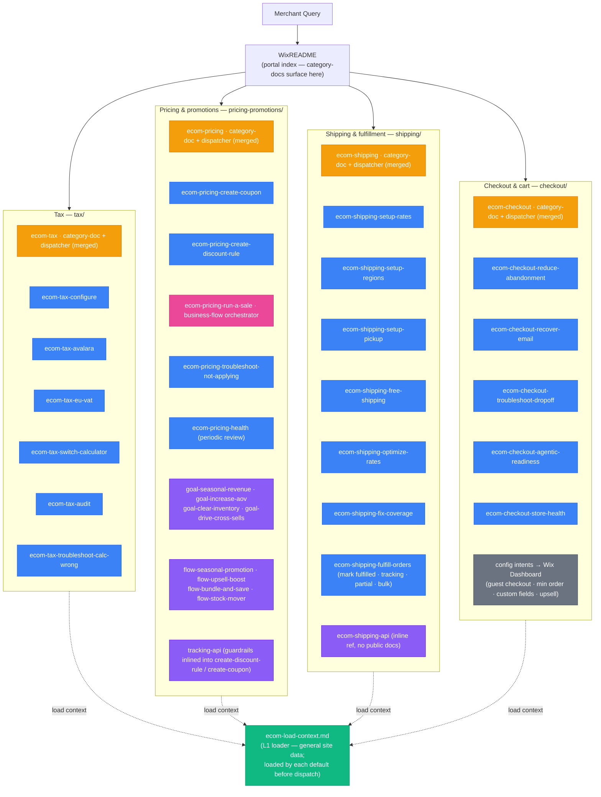

## Skill Graph Diagram

The arrows land on each L3 **group**; inside a group, files stack vertically with the `default` dispatcher first. Internal dispatch (default → promotion) and support chains (run-a-sale → goal → flow → guardrail/tracking) are documented in the reachability table below rather than drawn as edges.

## File Reachability

| File | Role | Reached via |
|---|---|---|
| `ecom-load-context.md` | L1 loader | Loaded by each `*-default` dispatcher before dispatch (skipped if context already loaded) |
| `ecom-tax.md` | category-doc + dispatcher (merged — prototype) | WixREADME portal index; dispatches directly, no `-default` hop |
| `ecom-pricing.md` | category-doc + dispatcher (merged) | WixREADME portal index; dispatches directly, no `-default` hop |
| `tax/ecom-tax-configure.md` | promotion | tax dispatch `[intent:configure-tax]` |
| `tax/ecom-tax-avalara.md` | promotion | tax dispatch `[intent:avalara]` |
| `tax/ecom-tax-eu-vat.md` | promotion | tax dispatch `[intent:eu-vat]` |
| `tax/ecom-tax-switch-calculator.md` | promotion | tax dispatch `[intent:switch-calculator]` |
| `tax/ecom-tax-audit.md` | promotion | tax dispatch `[intent:audit-tax]` |
| `tax/ecom-tax-troubleshoot-calc-wrong.md` | promotion | tax dispatch `[intent:troubleshoot]` |
| `pricing-promotions/ecom-pricing-create-coupon.md` | promotion | pricing dispatch `[intent:create-coupon]` |
| `pricing-promotions/ecom-pricing-create-discount-rule.md` | promotion | pricing dispatch `[intent:create-discount-rule / add-ribbon / schedule-sale]` |
| `pricing-promotions/ecom-pricing-run-a-sale.md` | business-flow | pricing dispatch `[intent:run-a-sale / boost-business / seasonal-promo / clearance / increase-aov]` |
| `pricing-promotions/ecom-pricing-troubleshoot-not-applying.md` | promotion | pricing dispatch `[intent:troubleshoot]` |
| `pricing-promotions/ecom-pricing-health.md` | promotion | pricing dispatch `[intent:pricing-health]` — periodic conflict/stale/margin sweep |
| `pricing-promotions/ecom-pricing-goal-seasonal-revenue.md` | support | run-a-sale → SEASONAL |
| `pricing-promotions/ecom-pricing-goal-increase-aov.md` | support | run-a-sale → UPSELL_BOOST / SHIPPING |
| `pricing-promotions/ecom-pricing-goal-clear-inventory.md` | support | run-a-sale → STOCK_MOVER |
| `pricing-promotions/ecom-pricing-goal-drive-cross-sells.md` | support | run-a-sale → BUNDLE_AND_SAVE |
| `pricing-promotions/ecom-pricing-flow-seasonal-promotion.md` | support | goal-seasonal-revenue |
| `pricing-promotions/ecom-pricing-flow-upsell-boost.md` | support | goal-increase-aov |
| `pricing-promotions/ecom-pricing-flow-bundle-and-save.md` | support | goal-increase-aov / goal-drive-cross-sells |
| `pricing-promotions/ecom-pricing-flow-stock-mover.md` | support | goal-clear-inventory |
| (discount-conflicts, margin-protection) | inlined | folded into create-discount-rule (+ create-coupon) — the skills they guard |
| `pricing-promotions/ecom-pricing-tracking-api.md` | support | run-a-sale (Steps 2 + 8) |
| `ecom-shipping.md` | category-doc + dispatcher (merged) | WixREADME portal index; dispatches directly |
| `shipping/ecom-shipping-setup-rates.md` | promotion | shipping dispatch `[intent:setup-rates]` |
| `shipping/ecom-shipping-setup-regions.md` | promotion | shipping dispatch `[intent:setup-regions]` |
| `shipping/ecom-shipping-setup-pickup.md` | promotion | shipping dispatch `[intent:setup-pickup]` |
| `shipping/ecom-shipping-free-shipping.md` | promotion | shipping dispatch `[intent:free-shipping]`; also loaded by run-a-sale → goal-increase-aov |
| `shipping/ecom-shipping-optimize-rates.md` | promotion | shipping dispatch `[intent:optimize-rates / rate-incorrect]`; also loaded by run-a-sale |
| `shipping/ecom-shipping-fix-coverage.md` | promotion | shipping dispatch `[intent:fix-coverage]` |
| `shipping/ecom-shipping-fulfill-orders.md` | promotion | shipping dispatch `[intent:fulfill-order]` — Fulfillments API (mark fulfilled, tracking, partial, bulk) |
| `shipping/ecom-shipping-api.md` | support | inline API reference (no public docs page) — linked from every shipping recipe |
| (rate-pricing-sanity, shipping-health) | inlined | folded into free-shipping / optimize-rates and fix-coverage — no separate files |
| (apply-recommendations) | dissolved | redundant with the API Reference (query → create/update by rec action) — §7.5 |
| `ecom-checkout.md` | category-doc + dispatcher (merged) | WixREADME portal index; dispatches directly |
| `checkout/ecom-checkout-reduce-abandonment.md` | promotion | checkout dispatch `[intent:reduce-abandonment]`; also loaded by run-a-sale ABANDONED_CART branch |
| `checkout/ecom-checkout-recover-email.md` | promotion | checkout dispatch `[intent:recover-email]` — Dashboard-configured automation, recipe guides config |
| `checkout/ecom-checkout-troubleshoot-dropoff.md` | promotion | checkout dispatch `[intent:troubleshoot-checkout]` |
| `checkout/ecom-checkout-agentic-readiness.md` | promotion | checkout dispatch `[intent:agentic]` — catalog data-quality + test-checkout |
| `checkout/ecom-checkout-store-health.md` | promotion | checkout dispatch `[intent:store-health]` — periodic technical health |
| (guest-checkout, min-order, custom-fields, upsell) | Dashboard | no TPA-public API — dispatch routes to the Wix Dashboard |
