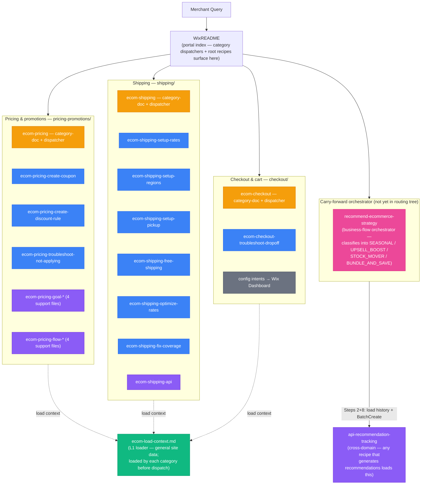

## Skill Graph Diagram

The arrows land on each L2 group. Internal dispatch and support chains are documented in the reachability table below.

## File Reachability

| File | Role | Reached via |
|---|---|---|
| `ecom-load-context.md` | L1 loader | Loaded by each kept category dispatcher when MerchantContext is missing |
| `api-recommendation-tracking.md` | cross-domain support | loaded by any recipe that generates recommendations (currently: `recommend-ecommerce-strategy` and the kept pricing flows) |
| `ecom-pricing.md` | category-doc + dispatcher | WixREADME portal index |
| `pricing-promotions/ecom-pricing-create-coupon.md` | promotion | pricing dispatch `[intent:create-coupon]` |
| `pricing-promotions/ecom-pricing-create-discount-rule.md` | promotion | pricing dispatch `[intent:create-discount-rule / add-ribbon / schedule-sale]` |
| `pricing-promotions/ecom-pricing-troubleshoot-not-applying.md` | promotion | pricing dispatch `[intent:troubleshoot]` |
| `pricing-promotions/ecom-pricing-goal-*.md` (4 files) | support | loaded by the pricing orchestrator (carry-forward `recommend-ecommerce-strategy.md`) |
| `pricing-promotions/ecom-pricing-flow-*.md` (4 files) | support | loaded by the goal files via embedded routing chain |
| `ecom-shipping.md` | category-doc + dispatcher | WixREADME portal index; shipping setup and rate/coverage optimization |
| `shipping/ecom-shipping-setup-rates.md` | promotion | shipping dispatch `[intent:setup-rates]` |
| `shipping/ecom-shipping-setup-regions.md` | promotion | shipping dispatch `[intent:setup-regions]` |
| `shipping/ecom-shipping-setup-pickup.md` | promotion | shipping dispatch `[intent:setup-pickup]` |
| `shipping/ecom-shipping-free-shipping.md` | promotion | shipping dispatch `[intent:free-shipping]` |
| `shipping/ecom-shipping-optimize-rates.md` | promotion | shipping dispatch `[intent:optimize-rates / rate-incorrect]` |
| `shipping/ecom-shipping-fix-coverage.md` | promotion | shipping dispatch `[intent:fix-coverage]` |
| `shipping/ecom-shipping-api.md` | support | inline API reference for Shipping Options and Delivery Profiles |
| `ecom-checkout.md` | category-doc + dispatcher | WixREADME portal index; live checkout/cart troubleshooting |
| `checkout/ecom-checkout-troubleshoot-dropoff.md` | promotion | checkout dispatch `[intent:troubleshoot-checkout / reduce-abandonment]` |
| `recommend-ecommerce-strategy.md` | business-flow orchestrator (carry-forward) | pricing dispatch `[intent:run-a-sale / boost-business / seasonal-promo / clearance / increase-aov]`; also surfaces directly in WixREADME |

*Guardrails (discount conflicts, margin protection, shipping health, rate pricing sanity) and `recipe-apply-shipping-recommendations` are no longer standalone files — their checks and API mechanics are inlined into the leaf recipes that perform the protected writes (pricing flows, discount-rule creation, shipping rate/region/free-shipping setup). `goal-reduce-cart-abandonment` is removed; the orchestrator's classification space is now 4-way (SEASONAL / UPSELL_BOOST / STOCK_MOVER / BUNDLE_AND_SAVE). Cart-abandonment recovery automation activation is no longer recommended by this routing tree.*
