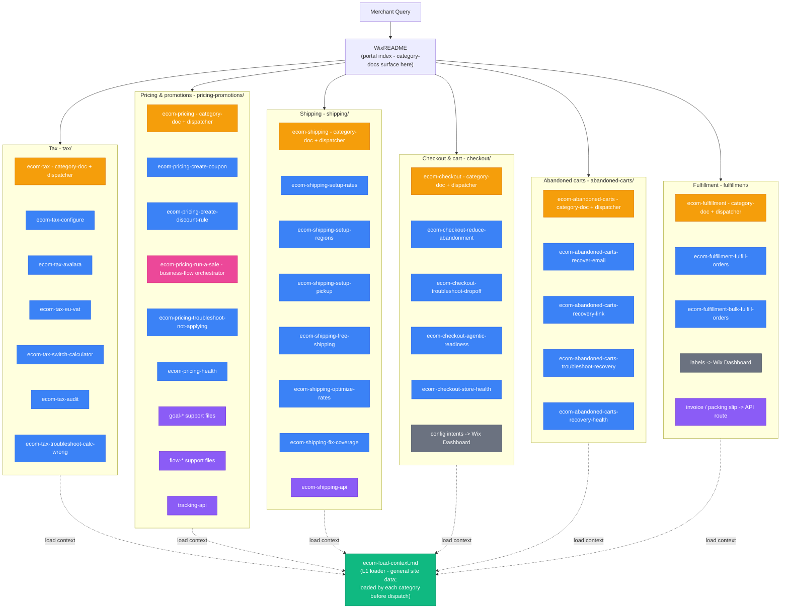

## Skill Graph Diagram

The arrows land on each L2 group. Internal dispatch and support chains are documented in the reachability table below.

## File Reachability

| File | Role | Reached via |
|---|---|---|
| `ecom-load-context.md` | L1 loader | Loaded by eCommerce category dispatchers when MerchantContext is missing |
| `ecom-tax.md` | category-doc + dispatcher | WixREADME portal index |
| `tax/ecom-tax-configure.md` | promotion | tax dispatch `[intent:configure-tax]` |
| `tax/ecom-tax-avalara.md` | promotion | tax dispatch `[intent:avalara]` |
| `tax/ecom-tax-eu-vat.md` | promotion | tax dispatch `[intent:eu-vat]` |
| `tax/ecom-tax-switch-calculator.md` | promotion | tax dispatch `[intent:switch-calculator]` |
| `tax/ecom-tax-audit.md` | promotion | tax dispatch `[intent:audit-tax]` |
| `tax/ecom-tax-troubleshoot-calc-wrong.md` | promotion | tax dispatch `[intent:troubleshoot]` |
| `ecom-pricing.md` | category-doc + dispatcher | WixREADME portal index |
| `pricing-promotions/ecom-pricing-create-coupon.md` | promotion | pricing dispatch `[intent:create-coupon]` |
| `pricing-promotions/ecom-pricing-create-discount-rule.md` | promotion | pricing dispatch `[intent:create-discount-rule / add-ribbon / schedule-sale]` |
| `pricing-promotions/ecom-pricing-run-a-sale.md` | business-flow | pricing dispatch `[intent:run-a-sale / boost-business / seasonal-promo / clearance / increase-aov]` |
| `pricing-promotions/ecom-pricing-troubleshoot-not-applying.md` | promotion | pricing dispatch `[intent:troubleshoot]` |
| `pricing-promotions/ecom-pricing-health.md` | promotion | pricing dispatch `[intent:pricing-health]` |
| `pricing-promotions/ecom-pricing-*.md` support files | support | loaded by the pricing orchestrator or linked recipes |
| `ecom-shipping.md` | category-doc + dispatcher | WixREADME portal index; shipping setup and rate/coverage optimization |
| `shipping/ecom-shipping-setup-rates.md` | promotion | shipping dispatch `[intent:setup-rates]` |
| `shipping/ecom-shipping-setup-regions.md` | promotion | shipping dispatch `[intent:setup-regions]` |
| `shipping/ecom-shipping-setup-pickup.md` | promotion | shipping dispatch `[intent:setup-pickup]` |
| `shipping/ecom-shipping-free-shipping.md` | promotion | shipping dispatch `[intent:free-shipping]`; also loaded by run-a-sale |
| `shipping/ecom-shipping-optimize-rates.md` | promotion | shipping dispatch `[intent:optimize-rates / rate-incorrect]` |
| `shipping/ecom-shipping-fix-coverage.md` | promotion | shipping dispatch `[intent:fix-coverage]` |
| `shipping/ecom-shipping-api.md` | support | inline API reference for Shipping Options and Delivery Profiles |
| `ecom-checkout.md` | category-doc + dispatcher | WixREADME portal index; live checkout/cart setup and troubleshooting |
| `checkout/ecom-checkout-reduce-abandonment.md` | promotion | checkout dispatch `[intent:reduce-abandonment]`; also loaded by run-a-sale ABANDONED_CART branch |
| `checkout/ecom-checkout-troubleshoot-dropoff.md` | promotion | checkout dispatch `[intent:troubleshoot-checkout]` |
| `checkout/ecom-checkout-agentic-readiness.md` | promotion | checkout dispatch `[intent:agentic]` |
| `checkout/ecom-checkout-store-health.md` | promotion | checkout dispatch `[intent:store-health]` |
| `ecom-abandoned-carts.md` | category-doc + dispatcher | WixREADME portal index; recovery/recapture after checkout abandonment |
| `abandoned-carts/ecom-abandoned-carts-recover-email.md` | promotion | abandoned-carts dispatch `[intent:recover-email]` |
| `abandoned-carts/ecom-abandoned-carts-recovery-link.md` | promotion | abandoned-carts dispatch `[intent:recovery-link]` |
| `abandoned-carts/ecom-abandoned-carts-troubleshoot-recovery.md` | promotion | abandoned-carts dispatch `[intent:troubleshoot-recovery]` |
| `abandoned-carts/ecom-abandoned-carts-recovery-health.md` | promotion | abandoned-carts dispatch `[intent:recovery-health]` |
| `ecom-fulfillment.md` | category-doc + dispatcher | WixREADME portal index; post-purchase fulfillment and shipping-document routing |
| `fulfillment/ecom-fulfillment-fulfill-orders.md` | promotion | fulfillment dispatch `[intent:fulfill-order / update-tracking / partial-fulfillment]` |
| `fulfillment/ecom-fulfillment-bulk-fulfill-orders.md` | promotion | fulfillment dispatch `[intent:bulk-fulfill]` |
| (shipping labels) | Dashboard | fulfillment dispatch `[intent:shipping-labels]`; no public API route in this repo |
| (invoice / packing slip) | API route | fulfillment dispatch `[intent:order-invoice]`; eCommerce Orders Invoice API |
