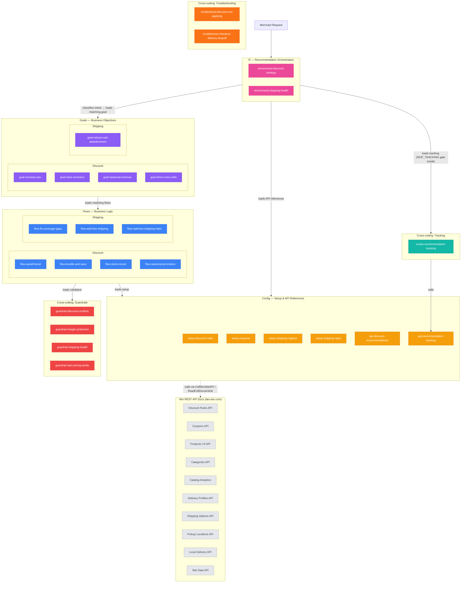

## Skill Graph Diagram

```mermaid
flowchart TB
    MR["Merchant Request"] --> R

    subgraph R["R — Recommendation Orchestration"]
        recommend-discount-strategy
        recommend-shipping-health
    end

    R --> |"classifies intent → loads matching goal"| Goals
    R --> |"loads API references"| Config
    R --> |"loads tracking (SKIP_TRACKING gate inside)"| Tracking

    subgraph Goals["Goals — Business Objectives"]
        subgraph GD["Discount"]
            goal-increase-aov
            goal-clear-inventory
            goal-seasonal-revenue
            goal-drive-cross-sells
        end
        subgraph GS["Shipping"]
            goal-reduce-cart-abandonment
        end
    end

    Goals --> |"loads matching flows"| Flows

    subgraph Flows["Flows — Business Logic"]
        subgraph FD["Discount"]
            flow-upsell-boost
            flow-bundle-and-save
            flow-stock-mover
            flow-seasonal-promotion
        end
        subgraph FS["Shipping"]
            flow-fix-coverage-gaps
            flow-add-free-shipping
            flow-optimize-shipping-rates
        end
    end

    Flows --> |"loads validation"| Guardrails
    Flows --> |"loads setup"| Config

    subgraph Guardrails["Cross-cutting: Guardrails"]
        guardrail-discount-conflicts
        guardrail-margin-protection
        guardrail-shipping-health
        guardrail-rate-pricing-sanity
    end

    subgraph Config["Config — Setup & API References"]
        setup-discount-rules
        setup-coupons
        setup-shipping-regions
        setup-shipping-rates
        api-discount-recommendations
        api-recommendation-tracking
    end

    subgraph Tracking["Cross-cutting: Tracking"]
        recipe-recommendation-tracking
    end

    Tracking --> |"calls"| api-recommendation-tracking

    subgraph Troubleshoot["Cross-cutting: Troubleshooting"]
        troubleshoot-discount-not-applying
        troubleshoot-checkout-delivery-dropoff
    end

    Config -.-> |"calls via CallWixSiteAPI / ReadFullDocsArticle"| API

    subgraph API["Wix REST API Docs (dev.wix.com)"]
        D1["Discount Rules API"]
        D2["Coupons API"]
        D3["Products V3 API"]
        D4["Categories API"]
        D5["Catalog Analytics"]
        S1["Delivery Profiles API"]
        S2["Shipping Options API"]
        S3["Pickup Locations API"]
        S4["Local Delivery API"]
        SD["Site Data API"]
    end

    classDef goal fill:#8b5cf6,stroke:#6d28d9,color:#fff
    classDef guardrail fill:#ef4444,stroke:#dc2626,color:#fff
    classDef flow fill:#3b82f6,stroke:#2563eb,color:#fff
    classDef config fill:#f59e0b,stroke:#d97706,color:#fff
    classDef reco fill:#ec4899,stroke:#db2777,color:#fff
    classDef tracking fill:#14b8a6,stroke:#0d9488,color:#fff
    classDef troubleshoot fill:#f97316,stroke:#ea580c,color:#fff
    classDef apidoc fill:#e5e7eb,stroke:#9ca3af,color:#374151

    class goal-increase-aov,goal-clear-inventory,goal-seasonal-revenue,goal-drive-cross-sells,goal-reduce-cart-abandonment goal
    class guardrail-discount-conflicts,guardrail-margin-protection,guardrail-shipping-health,guardrail-rate-pricing-sanity guardrail
    class flow-upsell-boost,flow-bundle-and-save,flow-stock-mover,flow-seasonal-promotion,flow-fix-coverage-gaps,flow-add-free-shipping,flow-optimize-shipping-rates flow
    class setup-discount-rules,setup-coupons,api-discount-recommendations,setup-shipping-regions,setup-shipping-rates,api-recommendation-tracking config
    class recommend-discount-strategy,recommend-shipping-health reco
    class recipe-recommendation-tracking tracking
    class troubleshoot-discount-not-applying,troubleshoot-checkout-delivery-dropoff troubleshoot
    class D1,D2,D3,D4,D5,S1,S2,S3,S4,SD apidoc
```
