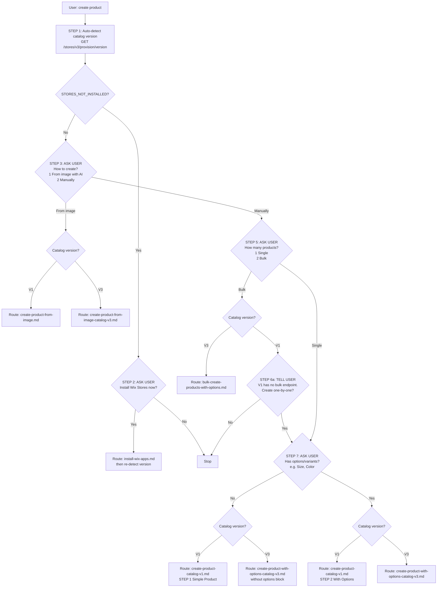

# RECIPE: Create Product (Router)

> **ALWAYS use this recipe as the entry point** when the user wants to create one or more products in their Wix Store. This includes any variation: "create product", "add a product", "new product", "make a product", "bulk create products", "create from image", "add items to my store", etc.
>
> Do NOT skip this router and call a downstream recipe directly. The router enforces correct catalog version detection and interactive guidance, which prevents API errors (e.g., 428 Precondition Required) and missed user requirements.

This router auto-detects the site's catalog version and then guides the user through the right downstream recipe via a series of short interactive questions.

---

## Decision Flow



---

## STEP 1: Auto-Detect Catalog Version (no user interaction)

**API Endpoint:** `GET https://www.wixapis.com/stores/v3/provision/version`

No request body — this is a GET request.

**Expected response:**

```json
{
    "catalogVersion": "V3_CATALOG"
}
```

Possible values for `catalogVersion`:

| Value | Action |
|-------|--------|
| `V3_CATALOG` | Save `version=V3`, go to STEP 3 |
| `V1_CATALOG` | Save `version=V1`, go to STEP 3 |
| `STORES_NOT_INSTALLED` | Go to STEP 2 |

---

## STEP 2: Ask to Install Wix Stores (only if STORES_NOT_INSTALLED) (INTERACTIVE)

Present to the user:

> Wix Stores is not installed on this site. Would you like me to install it now so we can create your product?

- **Yes** -> Route to [Install Wix Apps](../app-installation/install-wix-apps.md) using the Stores app definition ID, then re-run STEP 1 to detect the version.
- **No** -> Stop. Inform the user the product cannot be created without Wix Stores.

---

## STEP 3: Ask Creation Method (INTERACTIVE)

Present to the user:

> How would you like to create your product?
>
> 1. **From image with AI** — Upload product image(s) and I'll generate the name, description, price, and options for you.
> 2. **Manually** — I'll ask you for the product details directly.

**Wait for the user's response.**

- If **From image** -> go to STEP 4
- If **Manually** -> go to STEP 5

---

## STEP 4: Route to Image-Based Recipe

Based on the catalog version saved in STEP 1:

| Version | Recipe |
|---------|--------|
| V3 | [Create Product from Image (Catalog V3)](create-product-from-image-catalog-v3.md) |
| V1 | [Create Product from Image (Catalog V1)](create-product-from-image.md) |

These downstream recipes already include their own interactive flows for image collection, review, and options. Hand off to them and let them complete the product creation.

---

## STEP 5: Ask Scale (INTERACTIVE — only for "Manually")

Present to the user:

> How many products do you want to create?
>
> 1. **One product** — Create a single product
> 2. **Multiple products at once (bulk)** — Create many products in a single API request

**Wait for the user's response.**

- If **One product** -> go to STEP 7
- If **Multiple (bulk)** -> go to STEP 6

---

## STEP 6: Route to Bulk Recipe (only if Bulk + V3)

Based on the catalog version saved in STEP 1:

| Version | Action |
|---------|--------|
| V3 | Route to [Bulk Create Products with Options (Catalog V3)](bulk-create-products-with-options.md) |
| V1 | Go to STEP 6a |

### STEP 6a: V1 has no bulk endpoint (INTERACTIVE)

Present to the user:

> Catalog V1 does not support bulk product creation via API. I can create the products one at a time instead. Would you like to proceed?

- **Yes** -> Fall through to STEP 7 and create products one by one (loop the single flow per product).
- **No** -> Stop.

---

## STEP 7: Ask About Options (INTERACTIVE — only for Manual + Single)

Present to the user:

> Does your product have variants/options (such as Size, Color, Material)?
>
> 1. **No** — Simple product with a single SKU
> 2. **Yes** — Product with options and variants

**Wait for the user's response.**

- If **No** -> go to STEP 8 (simple)
- If **Yes** -> go to STEP 8 (with options)

---

## STEP 8: Route to Manual Recipe

Based on the catalog version (STEP 1) and options choice (STEP 7):

| Version | Options | Recipe |
|---------|---------|--------|
| V3 | No | [Create Product with Options (Catalog V3)](create-product-with-options-catalog-v3.md) — use the example without the `options` and `variantsInfo` blocks |
| V3 | Yes | [Create Product with Options (Catalog V3)](create-product-with-options-catalog-v3.md) |
| V1 | No | [Create Product (Catalog V1)](create-product-catalog-v1.md) — STEP 1: Simple Product section |
| V1 | Yes | [Create Product (Catalog V1)](create-product-catalog-v1.md) — STEP 2: With Options section |

Hand off to the chosen recipe. Be sure to collect any required details from the user (name, description, price, etc.) as the recipe specifies.

---

## Trigger Phrases

This router should be the entry point when the user says any of:

- "create a product" / "add a product" / "new product"
- "make a product" / "I want to add a product"
- "create product from image" / "create from photo"
- "bulk create products" / "add multiple products"
- "create item" / "add item to my store"
- "set up my store" (when they mean adding products)

---

## Troubleshooting

### Get Catalog Version returns 404 or authorization error
The API key may not have permission to access Stores APIs, or Stores may not be installed. Verify Stores is installed and the auth token has the correct scopes.

### User wants to create a digital product
The Stores REST API currently supports `productType: "PHYSICAL"` for product creation in the recipes available here. Inform the user that digital products may need to be set up through the Wix dashboard.

### User skips a question or provides ambiguous answer
Re-ask the question with the same options. Do NOT guess.

### User changes their mind mid-flow
Restart from the appropriate earlier step.

## References

- [Get Catalog Version](https://dev.wix.com/docs/rest/business-solutions/stores/catalog-versioning/get-catalog-version)
- [Install Wix Apps](../app-installation/install-wix-apps.md)
- [Create Product from Image (Catalog V3)](create-product-from-image-catalog-v3.md)
- [Create Product from Image (Catalog V1)](create-product-from-image.md)
- [Create Product with Options (Catalog V3)](create-product-with-options-catalog-v3.md)
- [Create Product (Catalog V1)](create-product-catalog-v1.md)
- [Bulk Create Products with Options (Catalog V3)](bulk-create-products-with-options.md)
- [Catalog Versioning Overview](https://dev.wix.com/docs/rest/business-solutions/stores/catalog-versioning/introduction)
